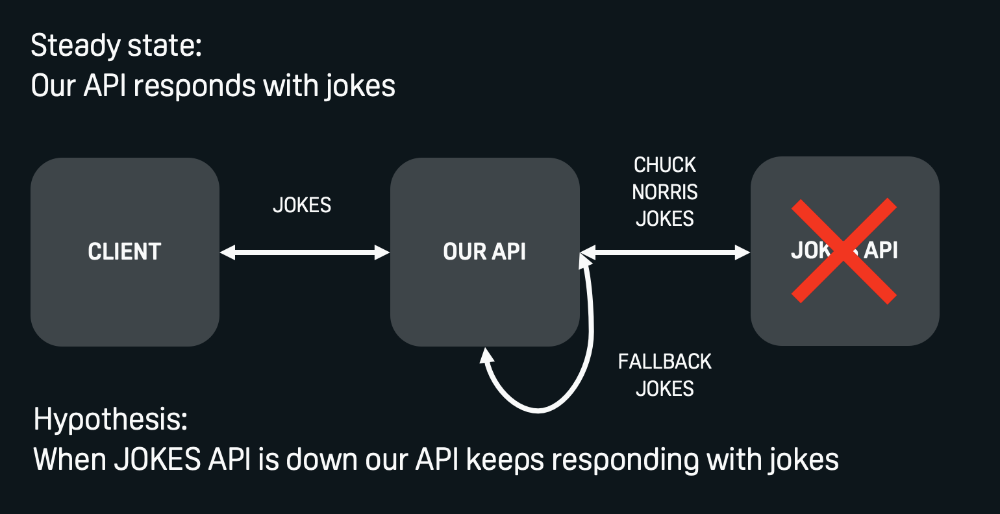

# chaos-demo
Chaos experiment demo with ChaosToolkit



## Prerequisites

* [python3](https://www.python.org/downloads/)
* [docker](https://docs.docker.com/engine/install/)
* [docker-compose](https://docs.docker.com/compose/install/)

## Services

This will run 2 docker containers: api & jokes-api (provider)

```sh
docker-compose -f docker-compose.failure.yaml up --build
# or
docker-compose -f docker-compose.resilient.yaml up --build
```

To cleanup containers:

```sh
docker-compose -f docker-compose.failure.yaml down
# or
docker-compose -f docker-compose.resilient.yaml down
```

You can test it by opening `web/index.html` in your browser. The page does the call to the api on each refresh.

NOTE: api is exposed on the port 3000

## Chaos experiment

### Steady state
Our api responds with status 200

### Action
Simulate jokes provider (jokes-api) downtime by stopping its docker container

```sh
docker stop jokes-api
```

### Rollback
Restart jokes provider (jokes-api) docker container

```sh
docker start jokes-api
```

## ChaosToolkit
The experiment can be executed with ChaosToolkit

### Setup
To create python `venv` and install ChaosToolkit just execute `setup.sh` in `chaos` directory:
```sh
. ./setup.sh
```

### Execute
Having active `venv` with installed `chaos/requirements.txt` [(setup.sh)](#setup) you can execute in `chaos` directory:
```sh
chaos run --rollback-strategy=always experiment.json
```